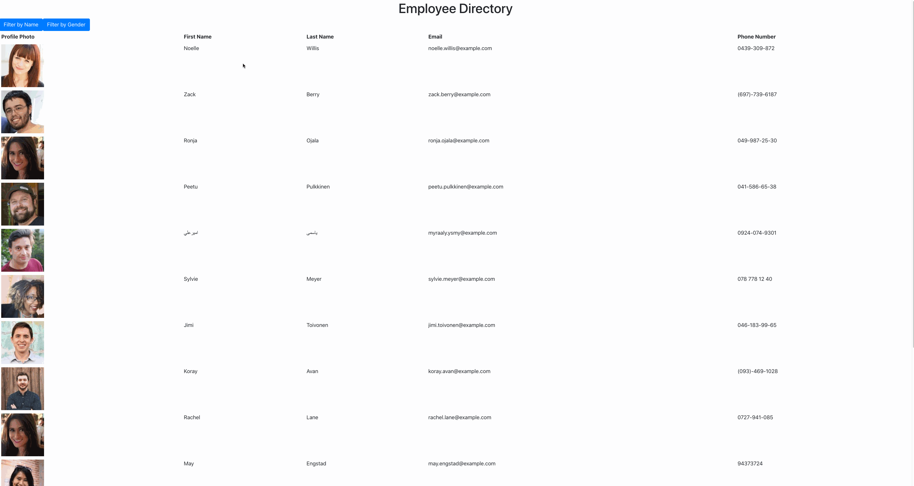

# Employee Directory
This simple application is a practice in using props and components that allows the user to view a list of employees. They can be filtered by last name or by gender (Can specifically Males right now, Females in future developement). Styling and search functionality in the works as well!

[Link to deployed application](https://cparros.github.io/react-employee-directory/)

## Future developement
Convert Buttons to Radio button to display males/females. Search functionality.

## Questions
celparros@gmail.com
